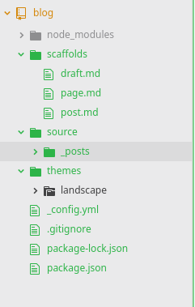

> 之前在弄这个博客的时候踩了一些坑，也看了一些教程，今天试着总结成一篇文章。  
> 注意： 我这里是在linux系统上搭建的，所以win上搭建会有点不一样，不过大致都差不多。

## 什么是 Hexo？
Hexo 是一个快速、简洁且高效的博客框架。Hexo 使用 Markdown（或其他渲染引擎）解析文章，在几秒内，即可利用靓丽的主题生成静态网页。

## 安装相关工具

### 安装Node.js以及Git

首先，你要先确保自己的系统中已经安装了下面这些应用程序，Hexo是基于Node.js的，而Git则是用来上传文件到github上的工具：

- Node.js
- Git

检验是否安装成功：

```bash
node -v
npm -v
git --version
```


### 换源，使用cnpm源

因为在国内直接用npm实在是太慢了，所以我选择使用淘宝的源，而用cnpm命令。

```bash
$ sudo npm install -g cnpm --registry=https://registry.npm.taobao.org   
```

### 安装Hexo

```bash
$ sudo cnpm install hexo-cli -g
```

## 初始化Hexo项目

在本地创建并进入blog文件夹

```bash
$ mkdir blog
$ cd blog
```

初始化hexo基础配置文件，初始化时间可能会比较长。

```bash
$ hexo init
```
目录结构  


生成静态文件
```bash
$ hexo g
```

加载hexo基础html、css、js等文件。
在这完成后等于已经在本地创建了一个网页，想查看的话，输入

```bash
$ hexo s
```


然后相当于开启了一个本地的服务器，会提示你拷贝url到浏览器。


## 在github上创建并设置远程库  

1. 创建仓库，名字必须是 用户名.github.io

2. 创建两个分支，master和hexo

3. 设置hexo为默认分支

### 使用git clone https://github.com/ZhanZongHan/(仓库名).git:克隆到本地

1. 将文件复制到blog文件夹中

```bash
$ cd ..
$ git clone https://github.com/ZhanZongHan/(仓库名).git
$ cp -r (仓库名)/.git .git
```

## 安装主题

https://hexo.io/themes/

```bash
$ git clone https://github.com/theme-next/hexo-theme-next themes/next
```

现在我们打开http://localhost:4000/ 已经可以看到一篇内置的blog了。

目前我安装所用的本地环境如下：(可以通过hexo -v查看)


### 在项目的config.yml中配置自己的远程仓库地址

```yml
# Deployment
## Docs: https://hexo.io/docs/deployment.html
deploy:
  type: git
  repo: https://github.com/wapchief/wapchief.github.io.git
  branch: master
```

提交项目，部署
继续在本目录命令行
安装部署工具（方便以后更新）
```bash
cnpm install hexo-deployer-git --save
```

这里有几个坑需要注意一下：

>1、所有的配置“:”符号后面都要带空格，否则执行本地测试直接失败。  
>2、language是设置语言。zh-CN是中文。  
>3、如果设置zh-Hans后仍出现乱码问题。需要更改文件的字符编码集为UTF-8,方法很多具体，就不详细介绍了。

## 发布hexo到github page
```bash
$ hexo clean && hexo g && hexo d #等于一次性执行了，清空、刷新、部署三个命令
```

## 总结

### Hexo常用的几个命令：

hexo generate (hexo g) 生成静态文件，会在当前目录下生成一个新的叫做public的文件夹  
hexo server (hexo s) 启动本地web服务，用于博客的预览  
hexo deploy (hexo d) 部署播客到远端（比如github, heroku等平台）  

### 另外还有其他几个常用命令：

```bash
$ hexo new "postName" #新建文章
$ hexo new page "pageName" #新建页面
```

### 常用简写
```bash
$ hexo n == hexo new
$ hexo g == hexo generate
$ hexo s == hexo server
$ hexo d == hexo deploy
```

### 常用组合
```bash
$ hexo d -g #生成部署
$ hexo s -g #生成预览
```


## 参考

-   [使用hexo+github免费搭建个人博客网站超详细教程](https://www.jianshu.com/p/a39573555039)
-   [使用 Hexo 创建项目文档网站](https://github.com/nodejh/nodejh.github.io/issues/37)
-   [blog+github备份和恢复](https://jinzequn.github.io/2018/01/24/github-hexo/)
-   [Hexo博客Next主题打开过慢的解决办法](http://www.mdslq.cn/archives/f186e832.html)
-   [使用hexo+github搭建个人博客遇到过哪些坑](https://www.jianshu.com/p/59e8d170346d)
-   [npm换源](https://www.jianshu.com/p/0deb70e6f395)
