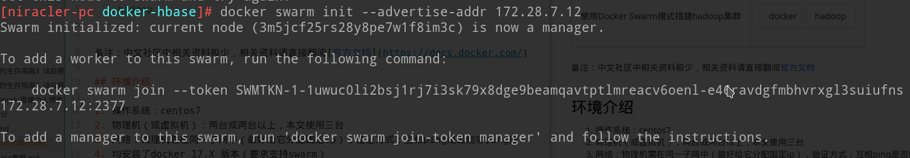
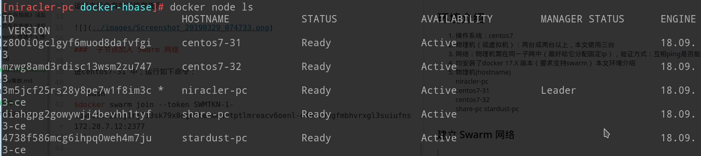

备注：中文社区中相关资料极少，相关资料请直接翻阅[官方文档](https://docs.docker.com/)

## 环境介绍

1. 操作系统：centos7
2. 物理机（或虚拟机）：两台或两台以上，本文使用三台
3. 网络：物理机需在同一子网中（最好给它分配固定ip），验证方式：互相ping是否能够ping通
4. 均安装了docker 17.X 版本（要求支持swarm）
本文环境介绍
1. 物理机(hostname)				
	niracler-pc			  
	centos7-31		
  centos7-32	 
  share-pc
  stardust-pc  			  


### 建立 Swarm 网络

>在 master 上运行以下命令，建立以 master 为主节点的 swarm 网络。注意，ip 改为你自己网络中 master 的 ip。

```bash
$docker swarm init --advertise-addr 172.28.7.12
```

运行之后会有如下信息提示



###  子节点加入 Swarm 网络

进centos7-31 中，运行如下命令：

```bash
$docker swarm join --token SWMTKN-1-1uwuc0li2bsj1rj7i3sk79x8dge9beamqavtptlmreacv6oenl-e46ravdgfmbhvrxgl3suiufns 172.28.7.12:2377
```

进centos7-32 中，运行如下命令：	 

```bash
$docker swarm join --token SWMTKN-1-1uwuc0li2bsj1rj7i3sk79x8dge9beamqavtptlmreacv6oenl-e46ravdgfmbhvrxgl3suiufns 172.28.7.12:2377
```

进share-pc 中，运行如下命令：  

```bash
$docker swarm join --token SWMTKN-1-1uwuc0li2bsj1rj7i3sk79x8dge9beamqavtptlmreacv6oenl-e46ravdgfmbhvrxgl3suiufns 172.28.7.12:2377
```

进stardust-pc 中，运行如下命令：  	

```bash
$docker swarm join --token SWMTKN-1-1uwuc0li2bsj1rj7i3sk79x8dge9beamqavtptlmreacv6oenl-e46ravdgfmbhvrxgl3suiufns 172.28.7.12:2377
```

然后在master节点使用 ```docker node ls``` 就能看到节点已经添加了



### 创建一个专用网络

运行如下命令，查看现由网络。可以看到只有一个swarm网络ingress。这个是默认网络，我们一般不会直接使用
```bash
$docker network ls

NETWORK ID          NAME                DRIVER              SCOPE
8b78fc47d7fb        bridge              bridge              local
9570aad7f0e0        docker_gwbridge     bridge              local
cf0d62f00408        host                host                local
xdelmzi55ifr        ingress             overlay             swarm
90c51fe9392a        none                null                local
```

创建一个专用网络
```bash
$docker network create --opt encrypted --driver overlay --attachable hadoop
```
创建完成后可以看到多出了一个hadoop网络
```bash
$docker network ls

8b78fc47d7fb        bridge              bridge              local
9570aad7f0e0        docker_gwbridge     bridge              local
iv1irku3ohf7        hadoop              overlay             swarm
cf0d62f00408        host                host                local
xdelmzi55ifr        ingress             overlay             swarm
90c51fe9392a        none                null                local
```

### 编写docker-compose

这里使用docker-compose,docker-compose-loc.yml内容如下:

```yml

```

### 启动

```bash
$docker stack deploy -c docker-compose-hadoop.yml hadoop
```

### 效果


## 参考文章

-   [使用docker搭建hadoop分布式集群](https://blog.csdn.net/xu470438000/article/details/50512442)  
-   [CentOS更换阿里云YUM源](https://www.jianshu.com/p/38c9e98ec481)   
-   [docker-hadoop](https://github.com/big-data-europe/docker-hadoop)  
-   [debian系linux，更换apt-get官方源为国内源](https://blog.csdn.net/yjk13703623757/article/details/78943345)  
-   [如何使用Apt-Get在Debian 8上安装Java](https://www.howtoing.com/how-to-install-java-with-apt-get-on-debian-8)  
-   [debian8无痛安装JDK8](https://www.jianshu.com/p/1cf26c0c9e9b)
-   [hadoop安装](https://www.apache.org/dyn/closer.cgi/hadoop/common/hadoop-2.7.7/hadoop-2.7.7.tar.gz)
-   [HBase Python API](https://www.cnblogs.com/fanghao/p/8542170.html)
-   [基于 docker 搭建 hadoop 跨主机集群](https://hacpai.com/article/1508232710946)
-   [Docker常用命令](https://segmentfault.com/a/1190000012063374)
-   [使用Docker Swarm模式搭建Swarm集群](https://www.jianshu.com/p/df744c4e375e)
-   [Hadoop: …be replicated to 0 nodes instead of minReplication (=1). There are 1 datanode(s) running and no node(s) are excluded in this operation](https://stackoverflow.com/questions/36015864/hadoop-be-replicated-to-0-nodes-instead-of-minreplication-1-there-are-1/36310025)
