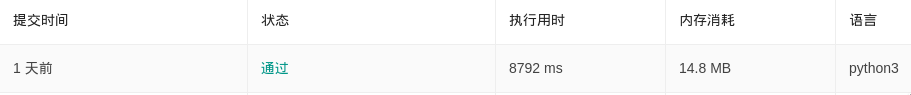

问题源于leetcode26题
------------------

给定一个排序数组，你需要在原地删除重复出现的元素，使得每个元素只出现一次，返回移除后数组的新长度。

不要使用额外的数组空间，你必须在原地修改输入数组并在使用 O(1) 额外空间的条件下完成。

示例 1:

```
给定数组 nums = [1,1,2],

函数应该返回新的长度 2, 并且原数组 nums 的前两个元素被修改为 1, 2。

你不需要考虑数组中超出新长度后面的元素。
```

示例 2:
```
给定 nums = [0,0,1,1,1,2,2,3,3,4],

函数应该返回新的长度 5, 并且原数组 nums 的前五个元素被修改为 0, 1, 2, 3, 4。

你不需要考虑数组中超出新长度后面的元素。
```
说明:

为什么返回数值是整数，但输出的答案是数组呢?

请注意，输入数组是以“引用”方式传递的，这意味着在函数里修改输入数组对于调用者是可见的。

你可以想象内部操作如下:

```
// nums 是以“引用”方式传递的。也就是说，不对实参做任何拷贝
int len = removeDuplicates(nums);

// 在函数里修改输入数组对于调用者是可见的。
// 根据你的函数返回的长度, 它会打印出数组中该长度范围内的所有元素。
for (int i = 0; i < len; i++) {
    print(nums[i]);
}
```

错误解法
------------

### 代码

```python
class Solution:
    def removeDuplicates(self, nums: List[int]) -> int:
        for num in nums:
            if nums.count(num) > 1:
                nums.remove(num)
        return len(nums)
```

### 输出结果


### 分析

原因是用for发起任何形式的遍历时，它的遍历顺序都是从最初就确定的，而在遍历中删除了元素会导致当前索引的变化，这样一是会导致漏删元素，二是会导致遍历超过链表的长度。

通过拷贝的List来删除初始的List
------------

### 代码

```python
class Solution:
    def removeDuplicates(self, nums: List[int]) -> int:
            for num in nums[:]:
                if nums.count(num) > 1:
                    nums.remove(num)

            return len(nums)

```

### 输出结果



### 分析
因为拷贝List的行为需要耗费资源。


我的第三个优化的解法
------------

### 代码

```python
class Solution:
    def removeDuplicates(self, nums: List[int]) -> int:
        if len(nums)==0:
            return 0
        cur = 0
        for i in range(1, len(nums)):
            if nums[i] != nums[cur]:
                cur += 1
                nums[cur] = nums[i]
        return cur+1
```

### 输出结果


### 分析
用两个指针，一个指针用于扫描遍历整个列表，另一个指针始终指向下一个数字要写入列表的位置。效果相当于在遍历列表的时候，将不同的数字重新写入到原数组。

参考
---
[Python的list循环遍历中，删除数据的正确方法](https://www.cnblogs.com/bananaplan/p/remove-listitem-while-iterating.html)  
[Python语法糖——遍历列表时删除元素](https://segmentfault.com/a/1190000007214571)  
[Remove all occurrences of a value from a list?](https://stackoverflow.com/questions/1157106/remove-all-occurrences-of-a-value-from-a-list)    
[How to remove items from a list while iterating?](https://stackoverflow.com/questions/1207406/how-to-remove-items-from-a-list-while-iterating)  
[27. 移除元素](https://leetcode-cn.com/problems/remove-element/)
